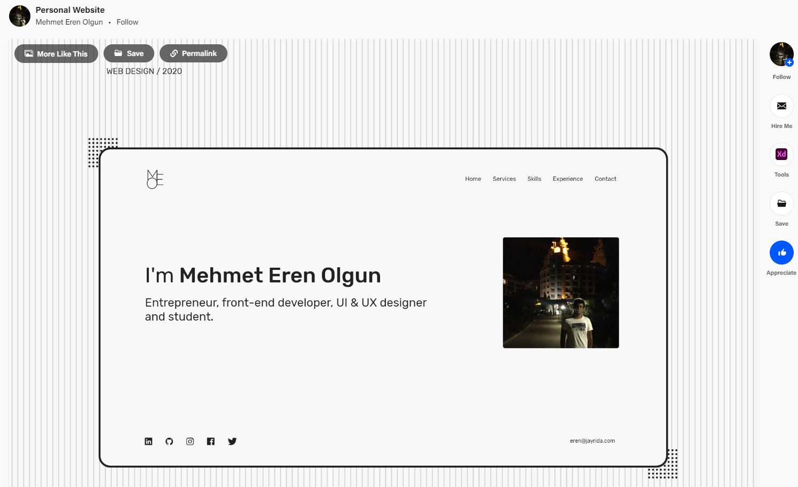

# minimal-folio
A minimalistic html template for a personal/portfolio website inspired by [Mehmet Eren Olgun's](https://www.behance.net/mehmeterenolgun) [design](https://www.behance.net/gallery/102515935/Personal-Website/modules/590142213):

https://www.behance.net/gallery/102515935/Personal-Website/modules/590142213

I used [Bootstrap 5.2](https://getbootstrap.com/docs/5.2/getting-started/introduction/) for styling and [Fontawesome 6.2](https://fontawesome.com/v6/search?o=r&m=free) for Icons.

[Demo Link]([https://demo-link](https://calm-ocean-0a9326f10.2.azurestaticapps.net/])
